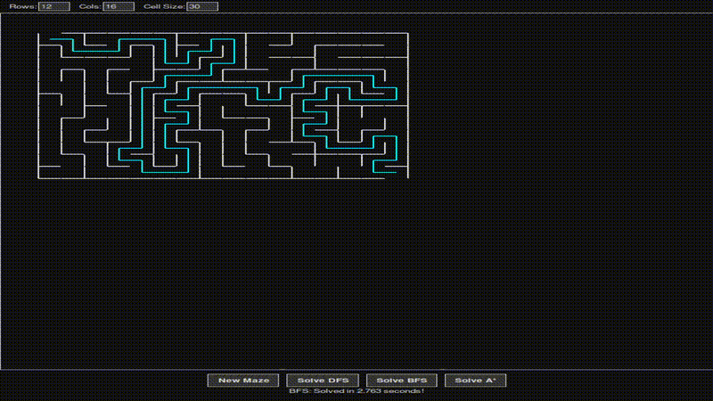

# Maze Solver Visualization

This project is a Python application that generates random mazes and visualizes different algorithms (Depth-First Search, Breadth-First Search, and A*) solving them. Users can customize maze parameters like rows, columns, and cell size.

## Demo





## Features

*   **Random Maze Generation:** Creates unique mazes using an iterative Depth-First Search approach.
*   **Multiple Solving Algorithms:**
    *   **Depth-First Search (DFS):** Explores as far as possible along each branch before backtracking.
    *   **Breadth-First Search (BFS):** Explores all neighbor nodes at the present depth prior to moving on to nodes at the next depth level.
    *   **A\* Search (A-Star):** A pathfinding algorithm that uses a heuristic (Manhattan distance) to efficiently find the shortest path.
*   **Customizable Maze Parameters:**
    *   Users can set the number of rows and columns.
    *   Users can set the cell size for drawing.
*   **Interactive UI:**
    *   Dark mode theme.
    *   Buttons to generate a new maze and trigger different solving algorithms.
    *   Displays the time taken for the solving algorithm to complete.
    *   Animated visualization of maze generation and pathfinding processes.
*   **Iterative Algorithms:** Maze generation and DFS solving algorithms are implemented iteratively to handle large mazes without recursion depth issues.

## How to Run

1.  **Prerequisites:**
    *   Python 3.x
    *   Tkinter (usually included with standard Python installations)

2.  **Clone the repository and ensure all project files are in the same directory.**

3.  **Navigate to the project directory in your terminal.**

4.  **Run the main application file:**
    ```bash
    python main.py
    ```

5.  **Using the Application:**
    *   Adjust the "Rows", "Cols", and "Cell Size" input fields at the top as desired.
    *   Click "New Maze" to generate a maze with the current parameters.
    *   Click "Solve DFS", "Solve BFS", or "Solve A*" to watch the respective algorithm find a path from the top-left to the bottom-right corner.
    *   The time taken to solve will be displayed below the maze.

## File Structure

*   `main.py`: The entry point of the application. Handles UI setup, event handling for buttons, and orchestrates maze creation and solving.
*   `maze.py`: Contains the `Maze` class, which is responsible for:
    *   Storing the maze structure (grid of `Cell` objects).
    *   Generating the maze (`_break_walls_iterative`).
    *   Implementing the solving algorithms (DFS, BFS, A\*).
    *   Drawing the maze and solution paths via the `Window` object.
*   `cell.py`: Defines the `Cell` class, representing a single cell in the maze. It stores wall states and handles drawing individual cells and moves between them.
*   `graphics.py`: Defines the `Window`, `Point`, and `Line` classes for the Tkinter-based graphical user interface. Handles drawing primitives, buttons, and input fields.
*   `README.md`: This file.

## Implemented Algorithms

### Maze Generation
*   **Iterative Depth-First Search with Backtracking:** Walls are carved out by performing a randomized DFS. An explicit stack is used to prevent recursion errors with large mazes.

### Maze Solving
*   **Depth-First Search (DFS):** An iterative implementation that explores one path as far as possible. If it hits a dead end or a visited cell, it backtracks and tries another path. The path found is not guaranteed to be the shortest.
*   **Breadth-First Search (BFS):** Explores the maze layer by layer, guaranteeing that the first time it reaches the exit, it has found the shortest path in terms of the number of steps.
*   **A\* Search (A-Star):** A more informed search algorithm. It uses a heuristic (Manhattan distance to the exit) in addition to the actual cost from the start to prioritize cells that are more likely to be on the shortest path. It also guarantees the shortest path.
